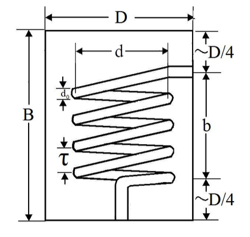
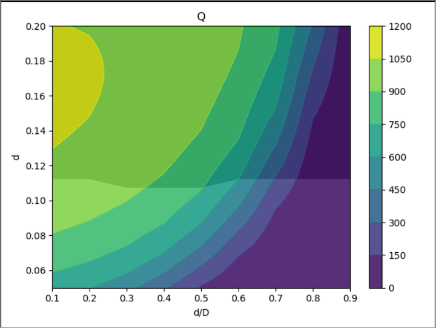

# Design of Helical Resonator for Ion Traps

Based primararily on "On the application of radio frequency voltages to ion traps via helical resonators" - Silverns, Simkins, Weidt, Hensinger. ([arXiv:1106.5013v3](https://arxiv.org/abs/1106.5013))

Helical resonator is a wire helix (inductor) surrounded by cylindrical conductive shield (conductor) that allows for impedence matching between the RF source and the ion trap to enable high voltage while reducing noise.

The code (helical_res.py) follows the Silverns paper which guides through the design and construction of such a resonator for any given ion trap system. Particularly, the program outputs contour plots of quality factor (Q) as a function of the coil diameter (d) and the coil to shield diameter ratio (d/D) for given input paramters described below. 

**Key**: D: Shield Diameter; d: Coil Diameter; B: Shield Height; b: Coil Height; d₀ : Wire Diameter; τ: Winding Pitch

In addition, the input paramters needed for the code are as below (these can be measured or estimated):

w₀: Resonant Frequency

Ct, Rt: Trap capacitance and resistance

Cw: Capacitance of ion trap connecting wires

Rj: Resistance due to shield-coil junction

d₀

τ

## Example of output:

**Input paramters**:

w₀ = 2π*10 MHz

Ct = Cw = 5 pF

Rt = 1 Ω

Rj = 0.5 Ω

d₀ = 5 mm

τ = 10 mm

